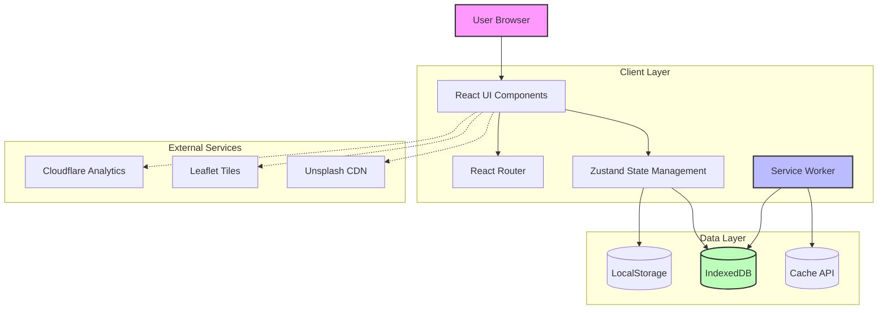
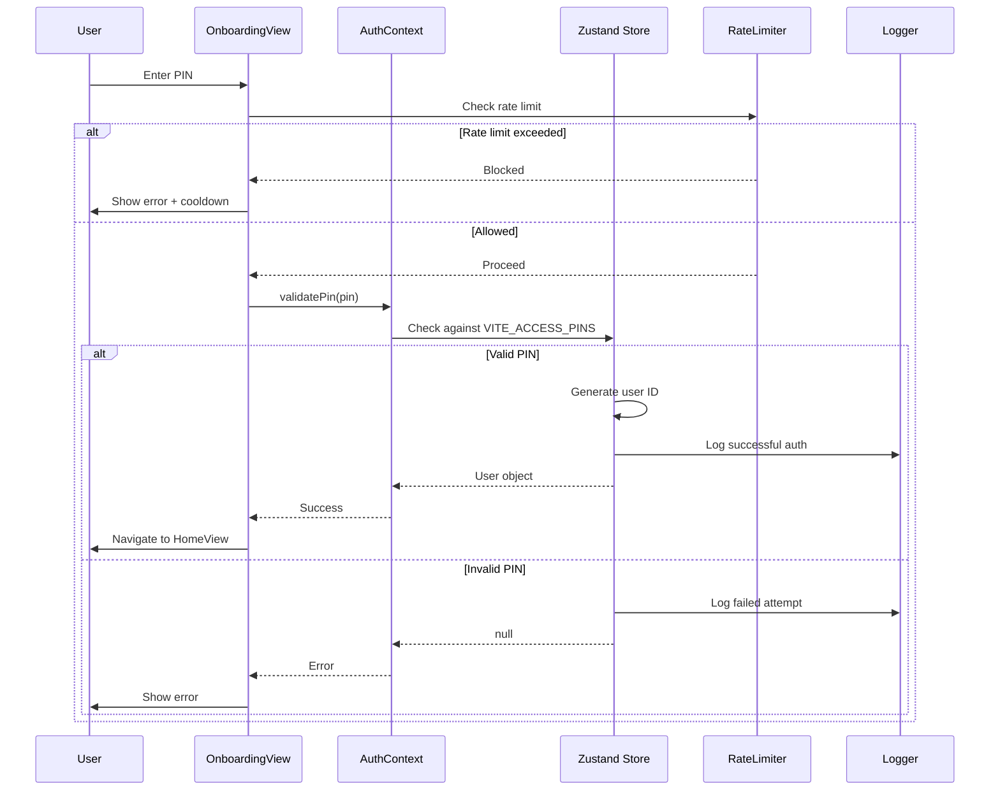
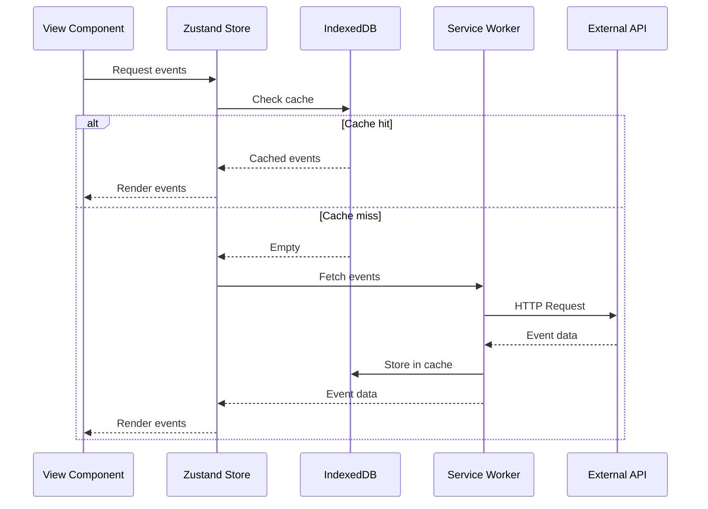
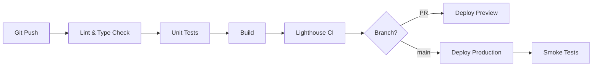

# DistritoBeef Architecture

## System Overview

DistritoBeef is a Progressive Web Application (PWA) designed for event discovery and itinerary management during Puerto Vallarta's BeefDip Bear Week and community events.

### Core Principles

1. **Offline-First**: Full functionality without network connectivity
2. **Privacy-Focused**: No server-side user tracking, client-side authentication
3. **Performance**: Sub-2s LCP, optimized bundle splitting
4. **Accessibility**: WCAG 2.1 AA compliant

---

## Architecture Diagram



---

## Component Hierarchy (Atomic Design)

### Atoms
Basic building blocks with no dependencies:
- `Badge` - Event category labels
- `GlassContainer` - Glassmorphism wrapper
- `IconButton` - Accessible icon buttons
- `MetaHead` - Dynamic meta tags

### Molecules
Simple combinations of atoms:
- `NotificationDrawer` - Notification panel
- `PullToRefresh` - Pull-to-refresh gesture
- `Toast` - Temporary notifications
- `EventDetail` - Event detail modal
- `AgendaItem` - Agenda list item

### Organisms
Complex, reusable sections:
- `UnifiedHeader` - App header with search/actions
- `Navigation` - Bottom navigation bar
- `AgendaView` - Full agenda management view

### Views (Pages)
Full-page layouts:
- `HomeView` - Featured events + quick actions
- `CalendarView` - 7-day event calendar
- `MapView` - Interactive venue map
- `WalletView` - User wallet/QR code
- `OnboardingView` - PIN authentication
- `ExploreView` - Event search/discovery

---

## Data Flow

### Authentication Flow



### Event Data Flow



---

## State Management

### Zustand Store Structure

```typescript
interface AppState {
  // Authentication
  isAuthenticated: boolean;
  user: UserData | null;
  
  // Agenda
  agendaIds: string[];
  
  // Actions
  login: (pin: string, provider: string) => void;
  logout: () => void;
  toggleAgendaItem: (id: string) => void;
}
```

### Persistence Strategy

- **LocalStorage**: User session, preferences
- **IndexedDB**: Event data, offline cache
- **Cache API**: Static assets, images, map tiles

---

## Security Model

### Threat Model

| Threat | Mitigation |
|--------|------------|
| PIN brute-force | Rate limiting (5 attempts/hour) |
| XSS injection | CSP headers, input sanitization |
| Data exfiltration | No server-side storage, client-only |
| MITM attacks | HTTPS-only, SRI for CDN assets |

### Content Security Policy

```
default-src 'self';
img-src 'self' https://images.unsplash.com data:;
style-src 'self' 'unsafe-inline' https://fonts.googleapis.com;
font-src 'self' https://fonts.gstatic.com;
script-src 'self';
connect-src 'self';
```

---

## Performance Optimizations

### Bundle Splitting

```typescript
// vite.config.ts
manualChunks: {
  leaflet: ['leaflet', 'react-leaflet'],
  icons: ['lucide-react'],
}
```

### Image Optimization

- Unsplash images loaded with `?w=800&q=80` params
- Lazy loading with `loading="lazy"`
- WebP format preferred

### Code Splitting

- Route-based lazy loading
- Dynamic imports for heavy components

---

## Observability

### Logging Levels

- **DEBUG**: Development-only, verbose
- **INFO**: Normal operations
- **WARN**: Recoverable issues
- **ERROR**: Failures requiring attention
- **CRITICAL**: System-wide failures

### Metrics Tracked

- Web Vitals (LCP, FID, CLS)
- Error rates
- API response times
- Cache hit rates
- User engagement (events viewed, agenda items)

---

## Deployment Architecture

### Environments

1. **Development** (`localhost:3000`)
   - Hot reload, debug logging
   - Mock data, relaxed CSP

2. **Staging** (`staging.distritobeef.com`)
   - Production build, test data
   - Full observability

3. **Production** (`distritobeef.com`)
   - Optimized build, real data
   - Strict CSP, rate limiting

### CI/CD Pipeline



---

## Future Enhancements

### Phase 2 Features
- [ ] Real-time event updates (WebSocket)
- [ ] Social features (attendee connections)
- [ ] Push notifications (PWA)
- [ ] Multi-language support (EN, ES, PT)

### Technical Debt
- [ ] Migrate to React Query for data fetching
- [ ] Add E2E tests (Playwright)
- [ ] Implement proper error boundaries per route
- [ ] Add performance monitoring dashboard

---

## References

- [Atomic Design Methodology](https://atomicdesign.bradfrost.com/)
- [PWA Best Practices](https://web.dev/progressive-web-apps/)
- [Zustand Documentation](https://zustand-demo.pmnd.rs/)
- [Vite Performance Guide](https://vitejs.dev/guide/performance.html)
